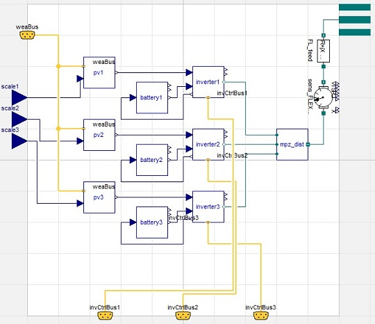
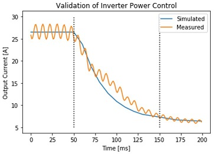

# SCooDER
#### Smart Control of Distributed Energy Resources
-------------------------------------------------------------------------

This [Modelica](https://www.modelica.org/) model library is developed to facilitate the simulation and optimization of Distributed Energy Resources such as Photovoltaics, Battery Storage, Smart Inverters, Electric Vehicles, and electric Power Systems.

## General
This package is developed to model various components of the electric power system in the context of future scenarios with high penetrations of Distributed Energy Resources (DER). The library is structured in four main categories:

* Solar: This library contains solar irradiaiton models.
* Components: This library contains the component models for various power system devices. It includes: Sensor, Inverter, Transformer, Photovoltacis, Battery, Controller, and Grid. Each component library ceontains of a Model and Examples folder.
* Systems: This library contains ensembles of components to form whole systems. An example (see below in Examples section) is the Flexgrid model which consists of three single-phase inverters, three batteries, and a number of sensors.
* uPMU: This library is specific to [micro-synchrophasor measurement units](https://www.powerstandards.com/product/micropmu) and covers the simulaiton of sensors and the integration of sensor measurements into simulations.

*Please note that the SCooDER package and especially the examples are still under development. Please open an issue for specific questions*

## Getting Started
The following link permits users to clone the source directory containing the [SCooDER](https://github.com/LBNL-ETA/SCooDER) package.

The package depends on the [Modelica Standard Library](https://github.com/modelica/ModelicaStandardLibrary) and [Modelica Buildings Library](https://github.com/lbl-srg/modelica-buildings).

## Example
The following model shows the Flexgrid model which can be found in the Systems library. It consists of a variety of Component models.

Most models are validated with equipment installed at [Lawrence Berkeley National Laboratory](https://lbl.gov). The example below shows the validation of an inverter response to a setpoint change in active power.

## License
Smart Control of Distributed Energy Resources (SCooDER) Copyright (c) 2019, The
Regents of the University of California, through Lawrence Berkeley National
Laboratory (subject to receipt of any required approvals from the U.S.
Dept. of Energy).  All rights reserved.

If you have questions about your rights to use or distribute this software,
please contact Berkeley Lab's Intellectual Property Office at
IPO@lbl.gov.

NOTICE.  This Software was developed under funding from the U.S. Department
of Energy and the U.S. Government consequently retains certain rights.  As
such, the U.S. Government has been granted for itself and others acting on
its behalf a paid-up, nonexclusive, irrevocable, worldwide license in the
Software to reproduce, distribute copies to the public, prepare derivative
works, and perform publicly and display publicly, and to permit other to do
so.

## Cite
To cite the SCooDER package, please use:

*Gehbauer, Christoph, Müller, J., Swenson, T. and Vrettos, E. 2019. Photovoltaic and Behind-the-Meter Battery Storage: Advanced Smart Inverter Controls and Field Demonstration. California Energy Commission.*